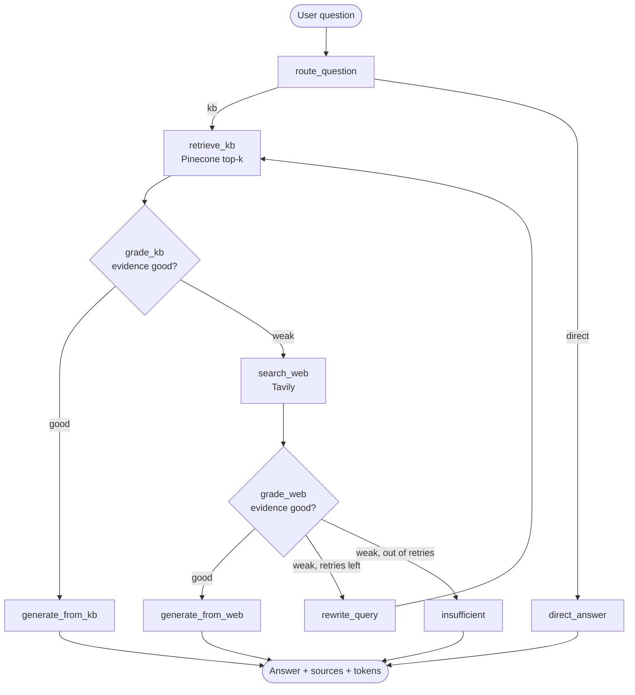
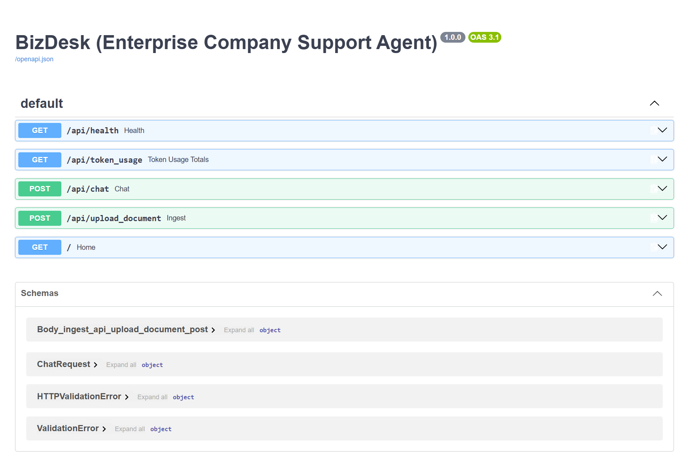
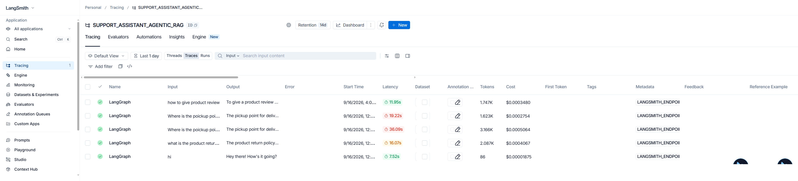

# BizDesk — Enterprise Support Agentic RAG

An agentic customer-support assistant built with **LangGraph**, **FastAPI** and **Pinecone**.
BizDesk answers customer questions from a private company knowledge base, grades its own
evidence before replying, falls back to live web search when the knowledge base comes up
short, and reports exactly what it did — sources, reasoning steps and token cost — with
every single answer.

The reference deployment is configured for **Daraz**, the South-Asian e-commerce platform.


---

## Table of contents

- [Why agentic RAG](#why-agentic-rag)
- [How it works](#how-it-works)
- [Features](#features)
- [Screenshots](#screenshots)
- [Tech stack](#tech-stack)
- [Getting started](#getting-started)
- [API reference](#api-reference)
- [Token usage tracking](#token-usage-tracking)
- [Observability with LangSmith](#observability-with-langsmith)
- [Conversation audit log](#conversation-audit-log)
- [Knowledge base ingestion](#knowledge-base-ingestion)
- [Configuration](#configuration)
- [Project structure](#project-structure)
- [Known limitations](#known-limitations)

---

## Why agentic RAG

A plain RAG pipeline retrieves chunks and generates an answer, whether or not the retrieved
chunks are any good. That produces confident answers built on irrelevant context — the worst
possible failure mode for customer support.

BizDesk adds decision-making between retrieval and generation:

| Plain RAG | BizDesk (agentic) |
|---|---|
| Always retrieves | Routes first — greetings skip retrieval entirely |
| Trusts whatever it retrieved | **Grades** the evidence before generating |
| Fails silently on weak evidence | Falls back to web search, then rewrites the query and retries |
| No fallback | Refuses to answer when nothing reliable is found |
| Opaque | Returns its full reasoning trace, sources and token cost |

The result is an assistant that knows the difference between "I found this in the company
policy," "I found this on the public web," and "I don't have a reliable answer."

---

## How it works

The workflow is a **LangGraph state machine**. Each node reads and writes a shared
`AgentState`, and conditional edges decide the path at runtime.



### The nodes

| Node | What it does | LLM call |
|---|---|---|
| `route_question` | Classifies the question as `kb` (needs company knowledge) or `direct` (greeting, thanks, small talk) | Structured |
| `retrieve_kb` | Similarity search over the Pinecone index, top-`k` chunks | — |
| `grade_kb` | Judges whether the retrieved chunks can answer the question confidently | Structured |
| `search_web` | Tavily search scoped to Daraz, collects results and citations | — |
| `grade_web` | Judges whether the web evidence is sufficient and relevant | Structured |
| `rewrite_query` | Rewrites the question with better retrieval keywords, then loops back | Plain |
| `generate_from_kb` | Answers strictly from private KB context, cites the source documents | Plain |
| `generate_from_web` | Answers from web evidence, explicitly labelled as external information | Plain |
| `direct_answer` | Short conversational reply, no retrieval | Plain |
| `insufficient` | Declines to answer and points the user to the support team | — |

The retry loop is bounded by `MAX_RETRIES` (default `1`), so the worst-case path is
route → retrieve → grade → web → grade → rewrite → retrieve → grade → … → answer.

---

## Features

**Retrieval and reasoning**
- Self-grading evidence check before every generation
- Automatic web fallback with real citations
- Query rewriting and bounded retry when both sources come up weak
- Explicit refusal instead of a hallucinated answer
- Structure-aware chunking that keeps each FAQ question with its own answer

**Transparency**
- Per-answer source attribution — private KB, web search, direct or insufficient
- Full reasoning trace exposed in the API and the UI
- Input/output token accounting for every LLM call, per node
- Every conversation persisted to SQLite with its token cost

**Interface**
- Minimal chat UI with dark/light theme, no build step and no frontend dependencies
- Staged progress messages during long agent runs, so a 30-second wait explains itself
- Markdown rendering that HTML-escapes model output before formatting it
- Admin panel for uploading documents into the knowledge base at runtime
- Live service health indicator and running session token counter

---

## Screenshots

### Chat — knowledge base and web fallback in one session

The first two answers come from the private knowledge base and cite the source PDF. The
third question isn't covered by the KB, so the agent fell back to web search and cited five
public sources — the badge under each answer says which path produced it.


### FastAPI — auto-generated OpenAPI docs

Available at `/docs` once the server is running.



### LangSmith — end-to-end tracing

Every graph run is traced: latency, token count and dollar cost per request, with the full
node-by-node breakdown one click away.



Real numbers from these traces: a direct reply costs **86 tokens / ~7.5s**, a knowledge-base
answer **~1.6–2.1K tokens / ~12–16s**, and a full web-fallback-with-rewrite run
**~3.2K tokens / ~36s**. Web fallback is roughly 2× the tokens and 3× the latency of a KB
hit, which is why the router and the KB grader matter.

---

## Tech stack

| Layer | Choice |
|---|---|
| Orchestration | LangGraph 1.1 (`StateGraph`) |
| API | FastAPI + Uvicorn |
| LLM | OpenAI `gpt-4o-mini` (configurable) |
| Embeddings | OpenAI `text-embedding-3-small`, 1536-d |
| Vector store | Pinecone serverless (AWS `us-east-1`), cosine |
| Web search | Tavily |
| Audit store | SQLite |
| Tracing | LangSmith |
| Frontend | Vanilla HTML/CSS/JS + Jinja2 |
| Document loaders | pypdf, python-docx |

---

## Getting started

### Prerequisites

- Python 3.11+ (developed on 3.13)
- API keys for **OpenAI**, **Pinecone** and **Tavily**
- Optionally a **LangSmith** key for tracing

### 1. Clone and install

```bash
git clone https://github.com/mahdi-islam-pranto/bizdesk.git
cd bizdesk

python -m venv .venv
.venv\Scripts\activate        # Windows
# source .venv/bin/activate   # macOS / Linux

pip install -r requirements.txt
```

### 2. Configure the environment

Create a `.env` file in the project root:

```env
OPENAI_API_KEY=sk-...
TAVILY_API_KEY=tvly-...
PINECONE_API_KEY=pcsk_...

# Optional — LangSmith tracing
LANGSMITH_TRACING=true
LANGSMITH_API_KEY=lsv2_...
LANGSMITH_ENDPOINT=https://api.smith.langchain.com
LANGSMITH_PROJECT="SUPPORT_ASSISTANT_AGENTIC_RAG"

# Optional — protects the document upload endpoint
ADMIN_API_KEY=your-own-admin-key
```

Every field in [`app/core/config.py`](app/core/config.py) can be overridden this way — see
[Configuration](#configuration).

### 3. Build the knowledge base

Drop your documents into `data/sample_kb/` (a Daraz FAQ PDF ships with the repo), then:

```bash
python create_knowledge_base.py
```

This creates the Pinecone index if it doesn't exist, chunks every file and upserts the
vectors:

```
Indexed 1 files -> 142 chunks -> 142 Pinecone vectors
```

> The index is created automatically with the dimension matching your embedding model. If an
> index of the same name exists with a **different** dimension, it is deleted and recreated.

### 4. Run

```bash
python run.py
```

| URL | What |
|---|---|
| http://127.0.0.1:8080 | Chat UI |
| http://127.0.0.1:8080/docs | Swagger / OpenAPI docs |
| http://127.0.0.1:8080/api/health | Health check |

---

## API reference

### `POST /api/chat`

Runs the full agent graph.

**Request**

```json
{ "question": "What payment methods does Daraz support?" }
```

**Response**

```json
{
  "answer": "Based on the company's private knowledge base, Daraz supports...",
  "source_used": "private_kb",
  "trace": [
    "Router → KB",
    "Private KB retrieval → 4 chunks",
    "KB evidence grade → GOOD",
    "Answer generation → PRIVATE KB",
    "Token usage → 3 LLM calls, input 2081, output 162, total 2243"
  ],
  "citations": [
    { "title": "Daraz.pdf", "url": "", "type": "private_kb" }
  ],
  "rewritten_query": "What payment methods does Daraz support?",
  "token_usage": {
    "input_tokens": 2081,
    "output_tokens": 162,
    "total_tokens": 2243,
    "llm_calls": 3,
    "by_node": [
      { "node": "route_question",   "input_tokens": 65,   "output_tokens": 5 },
      { "node": "grade_kb",         "input_tokens": 886,  "output_tokens": 5 },
      { "node": "generate_from_kb", "input_tokens": 1130, "output_tokens": 152 }
    ]
  }
}
```

`source_used` is one of `private_kb`, `web_search`, `direct` or `insufficient_evidence`.

### `GET /api/health`

```json
{ "status": "ok", "service": "BizDesk (Enterprise Company Support Agent)" }
```

### `GET /api/token_usage`

Cumulative spend across every stored conversation.

```json
{
  "conversations": 12,
  "input_tokens": 18422,
  "output_tokens": 1503,
  "total_tokens": 19925,
  "llm_calls": 34
}
```

### `POST /api/upload_document`

Adds a document to the knowledge base at runtime. Requires the `x-admin-key` header.
Accepts `.pdf`, `.docx`, `.txt`, `.md`.

```bash
curl -X POST http://127.0.0.1:8080/api/upload_document \
  -H "x-admin-key: your-own-admin-key" \
  -F "file=@./policies/refund-policy.pdf"
```

```json
{ "message": "Document indexed", "file": "refund-policy.pdf", "chunks": 23, "ids_created": 23 }
```

---

## Token usage tracking

Every LLM call in the graph reports its usage, and the totals accumulate across the whole
run — including the extra calls a retry loop adds.

The accumulation is done by LangGraph reducers on the state, so nodes never have to read the
running total before adding to it:

```python
class AgentState(TypedDict):
    ...
    input_tokens: Annotated[int, operator.add]
    output_tokens: Annotated[int, operator.add]
    llm_calls: Annotated[int, operator.add]
    token_usage_by_node: Annotated[List[dict], operator.add]
```

Plain calls expose `usage_metadata` directly. Structured-output calls need care —
`with_structured_output()` returns only the parsed Pydantic object and **discards the usage
metadata**, so BizDesk passes `include_raw=True` and reads the usage off the raw message:

```python
def invoke_structured_llm(node: str, schema, prompt: str):
    response = llm().with_structured_output(schema, method="json_mode", include_raw=True).invoke(prompt)
    return response["parsed"], token_usage(node, response["raw"])
```

Without that, the router and both graders would silently report zero tokens.

Usage surfaces in three places: the `token_usage` block of every `/api/chat` response, the
per-answer **Details** panel in the UI, and the `conversation_audit` table in SQLite.

---

## Observability with LangSmith

Set `LANGSMITH_TRACING=true` and `LANGSMITH_API_KEY` in `.env` — LangChain picks them up
automatically, no code changes needed. Each request appears as a `LangGraph` run with per-node
child spans, prompts, latency, token counts and cost, as shown in the
[screenshot above](#langsmith--end-to-end-tracing).

This is the fastest way to answer "why did it go to the web for that question?" — open the
trace and read the grader's actual verdict.

---

## Conversation audit log

Every conversation is written to SQLite at `data/conversation.db`:

```sql
CREATE TABLE conversation_audit (
    id               INTEGER PRIMARY KEY AUTOINCREMENT,
    created_at       TEXT    NOT NULL,   -- UTC ISO-8601
    question         TEXT    NOT NULL,
    source_used      TEXT    NOT NULL,
    trace_json       TEXT    NOT NULL,   -- full reasoning trace
    input_tokens     INTEGER NOT NULL DEFAULT 0,
    output_tokens    INTEGER NOT NULL DEFAULT 0,
    llm_calls        INTEGER NOT NULL DEFAULT 0,
    token_usage_json TEXT    NOT NULL DEFAULT '[]'  -- per-node breakdown
);
```

`init_db()` runs on startup and migrates existing databases by adding any missing column, so
upgrading an older `conversation.db` needs no manual steps.

Useful queries:

```sql
-- which source answers most questions?
SELECT source_used, COUNT(*), AVG(input_tokens + output_tokens) AS avg_tokens
FROM conversation_audit GROUP BY source_used ORDER BY 2 DESC;

-- the 10 most expensive questions
SELECT created_at, question, input_tokens + output_tokens AS total
FROM conversation_audit ORDER BY total DESC LIMIT 10;
```

---

## Knowledge base ingestion

The chunker in [`app/services/ingestion.py`](app/services/ingestion.py) is
**structure-aware** rather than a blind character split.

The Daraz FAQ is organised as `Point N: Topic` sections containing numbered questions, so the
ingester:

1. Joins all PDF pages **before** splitting — a question and its answer often straddle a page
   boundary, and per-page splitting would cut answers in half.
2. Normalises the text, repairing the one-word-per-line extraction pypdf produces for this
   PDF, plus ligatures and punctuation spacing.
3. Splits into one chunk per **question + answer pair**.
4. Prefixes every chunk with a context header — `[Point 3: Payments | Q12: How do I pay with bKash?]`
   — so a chunk retrieved on its own is still self-describing.
5. Sub-splits answers over 1500 characters, repeating the question header on each part so
   every piece stays retrievable.
6. Falls back to `RecursiveCharacterTextSplitter` (800 chars, 150 overlap) for documents that
   don't match this structure.

Metadata stored per chunk: `source`, `point_number`, `point_title`, `question_number`,
`question`, `chunk_type`.

---

## Configuration

All values live in [`app/core/config.py`](app/core/config.py) and are overridable from `.env`
(case-insensitive).

| Setting | Default | Purpose |
|---|---|---|
| `APP_NAME` | `BizDesk (Enterprise Company Support Agent)` | Shown in the API and page title |
| `APP_ENV` | `development` | Environment label |
| `OPENAI_API_KEY` | — | **Required** |
| `TAVILY_API_KEY` | — | **Required** for web fallback |
| `PINECONE_API_KEY` | — | **Required** |
| `PINECONE_INDEX_NAME` | `daraz-faq-rag` | Index name |
| `PINECONE_NAMESPACE` | `daraz-faq-kb` | Namespace inside the index |
| `EMBEDDING_MODEL` | `text-embedding-3-small` | Dimension is derived automatically |
| `OPENAI_MODEL` | `gpt-4o-mini` | Model for all graph nodes |
| `TOP_K` | `4` | Chunks retrieved per query |
| `MAX_RETRIES` | `1` | Query-rewrite retries before giving up |
| `ADMIN_API_KEY` | `change-in-production` | Guards `/api/upload_document` |
| `AUDIT_DB_PATH` | `data/conversation.db` | SQLite audit database |
| `UPLOAD_DIR` | `uploads/` | Where uploaded documents are stored |
| `SAMPLE_KB_DIR` | `data/sample_kb/` | Source folder for `create_knowledge_base.py` |

---

## Project structure

```
.
├── app/
│   ├── api/
│   │   └── api_routes.py        # chat, health, token_usage, upload endpoints
│   ├── core/
│   │   ├── config.py            # pydantic-settings, .env loading
│   │   └── logging.py
│   ├── rag/
│   │   ├── state.py             # AgentState + token reducers, grading schemas
│   │   ├── workflow.py          # LangGraph nodes, edges and token capture
│   │   └── vector_store.py      # Pinecone index, embeddings, retriever
│   ├── services/
│   │   ├── ingestion.py         # loaders + structure-aware chunking
│   │   └── store_conversations.py  # SQLite audit log + migration
│   └── main.py                  # FastAPI app, static mounts, page route
├── data/
│   ├── sample_kb/               # source documents
│   └── conversation.db          # audit log (created on first run)
├── static/
│   ├── css/style.css
│   └── js/app.js                # chat client, markdown renderer, staged loader
├── templates/index.html
├── screenshots/
├── create_knowledge_base.py     # one-off KB build script
├── run.py                       # uvicorn entry point
└── requirements.txt
```

---

## Known limitations

- **No conversation memory.** Each request runs the graph on a single question; the UI shows
  history but the backend never receives it, so follow-ups like *"how long does that take?"*
  won't resolve. Adding memory means threading prior turns through `AgentState` and the
  generation prompts.
- **No streaming.** `/api/chat` returns one JSON payload when the graph finishes. The UI's
  staged progress text is time-based, not driven by real node events.
- **Single-tenant.** No authentication, users or per-session isolation; the admin key is a
  single shared secret.
- **Retrieval is unfiltered** — plain top-`k` similarity with no metadata filtering or
  reranking.
- **Web fallback is scoped to Daraz** by a hardcoded prefix in the search query
  ([`workflow.py`](app/rag/workflow.py)); change it for a different company.

---

## License

See [LICENCE](LICENCE).
